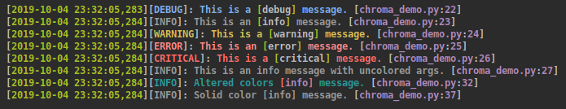

# Chroma Formatter
An extended Python logging formatter that adds color.



## Installation

Chroma Formatter is on PyPI and can be installed with:

```
pip install chromaformatter
```

## Usage
Chroma Formatter adds two features to the default logging formatter, colors can
be added to the log format string, and formatted arguments in a log message can
be colored. Colors can be inserted info the format string as such:

```python
log_format = (
    f'{Colors.Fore.GREEN}%(asctime)-s '
    f'{Colors.LEVEL_COLOR}%(levelname).1s '
    f'{Colors.Fore.MAGENTA}%(filename)-s:%(lineno)03d '
    f'{Colors.LEVEL_COLOR}- %(message)s'
)
```

Then, use chromaformatter.ChromaFormatter rather than logging.Formatter.

```python
import sys
import logging
from chromaformatter import ChromaFormatter, Colors

log = logging.getLogger()
log_format = (
    f'{Colors.Fore.GREEN}%(asctime)-s '
    f'{Colors.LEVEL_COLOR}%(levelname).1s '
    f'{Colors.Fore.MAGENTA}%(filename)-s:%(lineno)03d '
    f'{Colors.LEVEL_COLOR}- %(message)s'
)
formatter = ChromaFormatter(
    fmt=log_format,
    arg_start_color=Colors.Fore.WHITE,
    arg_end_color=Colors.LEVEL_COLOR
)
handler = logging.StreamHandler(stream=sys.stdout)
handler.setFormatter(formatter)
log.addHandler(handler)
```

### Formatted Arguments in a Log
By setting `arg_start_color` for argument colors and `arg_end_color` for the
rest of the string that comes after the argument, those colors will be applied
to arguments.

```python
log.info('This %s will be colored.', 'variable')
```

### Additional Configuration
ChromaFormatter has a dict called `color_map` to determine the colors of each
logging level.

By default, the colors are:

| Category | Color             |
| -------- | ----------------- |
| NOTSET   | Fore.LIGHTBLUE_EX |
| DEBUG    | Fore.BLUE         |
| INFO     | Fore.Cyan         |
| WARNING  | Fore.YELLOW       |
| ERROR    | Fore.LIGHTRED_EX  |
| CRITICAL | Fore.RED          |
| ARGS     | Fore.White        |

Color map can be changed as such:
```python
formatter.color_map[logging.INFO] = Colors.Fore.WHITE
formatter.color_map[logging.DEBUG] = Colors.Fore.MAGENTA
```

## Applying to Existing Loggers
If you are using a third party module that uses the standard python logging
module you can apply a ChromaFormatter as such:
```python
import sys
import logging

from chromaformatter import ChromaFormatter, Colors

log_format = (
    f'{Colors.Fore.GREEN}%(asctime)-s '
    f'{Colors.LEVEL_COLOR}%(levelname).1s '
    f'{Colors.Fore.MAGENTA}%(filename)-s:%(lineno)03d '
    f'{Colors.LEVEL_COLOR}- %(message)s'
)
stream_formatter = ChromaFormatter(log_format)
stream_handler = logging.StreamHandler(stream=sys.stdout)

flask_logger = logging.getLogger('werkzeug')
while flask_logger.handlers:
    flask_logger.removeHandler(flask_logger.handlers.pop())
flask_logger.addHandler(stream_handler)
```
