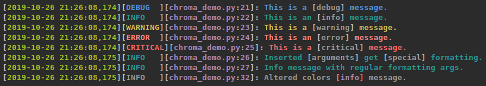
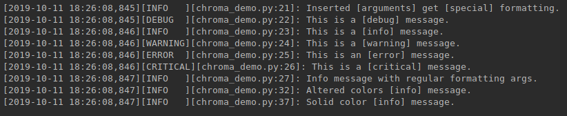

# Chroma Logging
### A wrapper for the standard python logging module to add color.




## Usage
Chroma Logging is designed work just like the regular logging module
except instead of a regular Formatter you use ChromaFormatter which
takes a boolean to determine whether or not to apply color, and another
boolean to determine whether to log in all bold.

Then can include colors in the format string with a with $COLOR.
```python
import sys
import chromalogging as logging

log = logging.getLogger()
log_format = '[$GREEN%(asctime)s$R][%(levelname)-7s$R][$MAGENTA' \
             '%(filename)s$R:$MAGENTA%(lineno)-d$R]: %(message)s'
formatter = logging.ChromaFormatter(log_format, use_color=True, all_bold=True)
handler = logging.StreamHandler(stream=sys.stdout)
handler.setFormatter(formatter)
log.addHandler(handler)
```

The colors supported are:
BLACK RED LI_RED
GREEN YELLOW
LI_BLUE BLUE
MAGENTA CYAN
WHITE

Additionally $BOLD or $B applies bold text and $RESET or $R resets back
to no colors or bold text.

#### Configuration

By default the logging level colors are:
- DEBUG: Colors.LI_BLUE
- INFO: Colors.WHITE
- WARNING: Colors.YELLOW
- ERROR: Colors.LI_RED
- CRITICAL: Colors.RED

Formatted arguments will be surrounded by brackets, the args and the
brackets have configurable colors.

Colors can be changed as such:
```python
logging.color_map[logging.INFO] = logging.Colors.CYAN
logging.color_map[logging.BRACKET] = logging.Colors.RED
logging.color_map[logging.ARGS] = logging.Colors.MAGENTA
```
