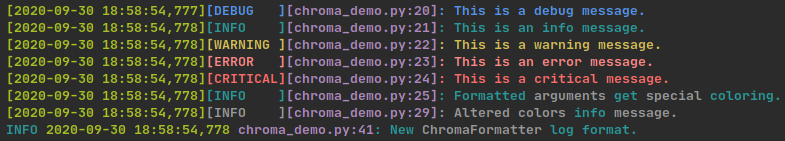
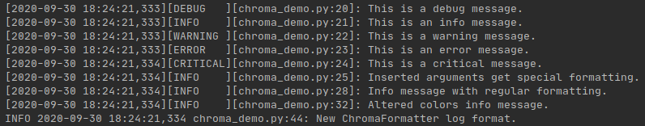

# Chroma Logging
### A wrapper for the standard python logging module to add color.




## Installation
Chroma Logging is on PyPI and can be installed with:
```
pip install chromalogging
```

## Usage
Chroma Logging works just like the regular logging module except instead
of a regular Formatter it uses ChromaFormatter which takes a boolean
to determine whether or not to apply color, and another boolean to
determine whether to log in all bold.

```python
import sys
import chromalogging as logging

log = logging.getLogger()
log_format = logging.default_format_msg(levelname_min=5)
formatter = logging.ChromaFormatter(log_format)
handler = logging.StreamHandler(stream=sys.stdout)
handler.setFormatter(formatter)
log.addHandler(handler)
```

##### Custom Formatting
Alternatively custom format messages can be made. To use a color in a
log use $<COLOR_NAME_HERE> to add a color. $LEVEL or $Lto refer to the
color of the logging level for a log:
```python
log_format = ('$GREEN[%(asctime)-s]'
              '$LEVEL[%(levelname)-s]'
              '$MAGENTA[%(filename)-s:'
              '%(lineno)-d]$LEVEL: %(message)s')
```

All supported colors:

| Regular  | Light       |
| -------- | ----------- |
| $BLACK   | $LI_BLACK   |
| $RED     | $LI_RED     |
| $GREEN   | $LI_GREEN   |
| $YELLOW  | $LI_YELLOW  |
| $BLUE    | $LI_BLUE    |
| $MAGENTA | $LI_MAGENTA |
| $CYAN    | $LI_CYAN    |
| $WHITE   | $LI_WHITE   |

Additionally $BOLD or $B applies bold text and $RESET or $R resets back
to no colors or bold text.

All special codes:

| Verbose|Short Hand|
| ------ |--------- |
| $BOLD  | $B       |
| $RESET | $R       |
| $LEVEL | $L       |


#### Additional Configuration

ChromaFormatter has a dict called color_map to determine the colors of
other parts of the log msg. Logging levels, brackets and the colors of
formatted arguments are all set in color_map.

By default the colors are:

| Category | Color       |
| -------- | ----------- |
| DEBUG    | BLUE        |
| INFO     | Cyan        |
| WARNING  | YELLOW      |
| ERROR    | LIGHTRED_EX |
| CRITICAL | RED         |
| ARGS     | White       |
| BRACKETS | None        |

To change colors:
```python
formatter.color_map[logging.INFO] = colorama.Fore.WHITE
formatter.color_map[logging.BRACKETS] = colorama.Fore.RED
formatter.color_map[logging.ARGS] = colorama.Fore.MAGENTA
```
Any colorama colors work here.

## Applying to Existing Loggers
If you are using a third party module that uses the standard python
logging module you can apply a ChromaFormatter as such:
```python
import sys

import chromalogging as logging

log_format = logging.default_format_msg()
stream_formatter = logging.ChromaFormatter(log_format)
stream_handler = logging.StreamHandler(stream=sys.stdout)

flask_logger = logging.getLogger('werkzeug')
flask_logger.addHandler(stream_handler)
```
