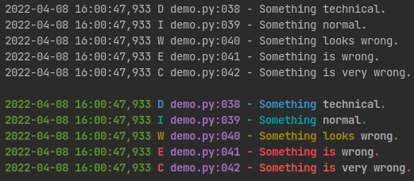

# Chroma Logging
### A wrapper for the standard python logging module to add color.



## Usage
Chroma Logging is designed work just like the regular logging module
except instead of a regular Formatter you use ChromaFormatter which
takes a boolean to determine whether or not to apply color.

Then can include colors in the format string with a with $COLOR.
```python
import sys
import chromalogging as logging

log = logging.getLogger()
log_format = '[$GREEN%(asctime)s$R][%(levelname)-6s$R]: %(message)s ' \
             '$R[$MAGENTA%(filename)s$R:$MAGENTA%(lineno)-d$R]'
stream_formatter = logging.ChromaFormatter(log_format, True)
stream_handler = logging.StreamHandler(stream=sys.stdout)
stream_handler.setFormatter(stream_formatter)
log.addHandler(stream_handler)
```

The colors supported are:
BLACK RED LI_RED
GREEN YELLOW
LI_BLUE BLUE
MAGENTA CYAN
WHITE

Additionally $BOLD or $B applies bold text and $RESET or $R resets back
to no colors or bold text.

#### Configuration

By default the logging level colors are:
- DEBUG: Colors.LI_BLUE
- INFO: Colors.WHITE
- WARNING: Colors.YELLOW
- ERROR: Colors.LI_RED
- CRITICAL: Colors.RED

Formatted arguments will be surrounded by brackets, the args and the
brackets have configurable colors.

Colors can be changed as such:
```python
logging.color_map[logging.INFO] = logging.Colors.CYAN
logging.color_map[logging.BRACKET] = logging.Colors.RED
logging.color_map[logging.ARGS] = logging.Colors.MAGENTA
```

Logs can be made completely bold by default:
```python
logging.all_bold = True
```
This has to be set before the ChromaFormatter is initialized or it will
only work for the logging level, brackets, and args.
